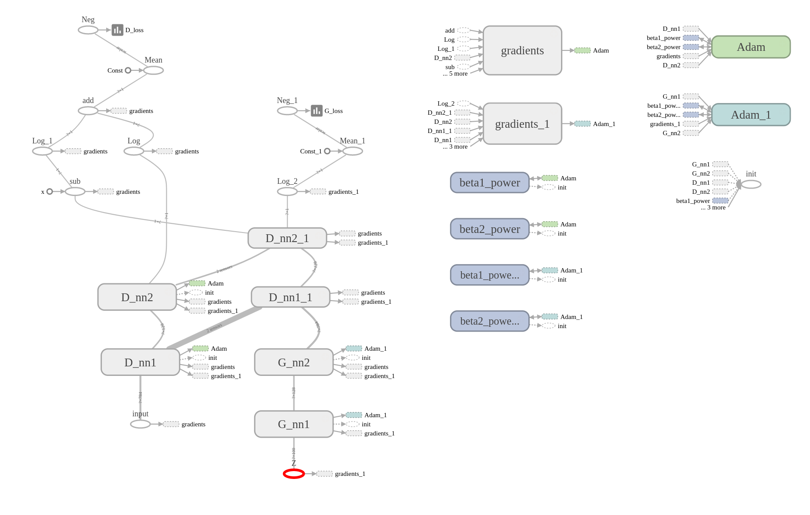
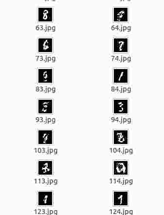

撰写时间：2017.8.18

# GANs实现(Generative Adversarial Networks)

网上有很多大神关于GAN的各种发展的介绍，对于一个刚刚接触到GANs的新手来说。如何将简单的GAN网络搭建起来是尤为重要的，所以下面这篇博文就主要记录了对[最原始的GAN论文](https://arxiv.org/pdf/1406.2661.pdf)的一点分析和简单的代码实现。

## Generator和Discriminator
* Generator是一个生成网络，随机噪声ｚ，通过Ｇ网络生成图片，记做G(z)。
* Discriminator是一个判别器网络，将噪声与训练样本糅合，然后判断real和fake样本。

## 优化方程
设：
$$V(D,G) = E_{x-P_{data}(x)}[logD(x)]+E_{z-P_z(z)}[log(1-D(G(z)))]$$
则优化目标即为：
$$\min_G\max_DV(D,G)$$

$\max_D(V)$使得判别器具有识别真伪的能力，而$\min_G(V)$使得判别器D不能将生成的图像正确分类。两者相互博弈，==最后的最优结果就是$D(G(z)) = 1/2$,虽然D的能力很强，但也不能确定G(z)为真还是假。==

关于结果的证明，读者可以参考原始论文，原始论文中对优化的证明还是很详细的。下面我们直接使用tensorflow代码实现

## 代码实现
因为代码面向的新手，所以不管是原始架构，还是代码的编辑，都是采用了最简单的方式。数据也选择了最常用的mnist数据。目的就是让读者可以无障碍的理解。==GAN网络的原理和代码真的很简单，所以如果初次接触真的不需要害怕它。==

### 网络架构

#### 架构说明：

* D_开头的节点就是判别器网络架构，==简单的两层全连接层。==输入是x,shape为[batch_size,28*28],输出是[batch_size]。
* G_开头的节点就是生成器网络，==也是简单的两层全连接层。==输入是随机生成的z，shape为[batch_size,100],输出为[batch_size,28*28]
* (D_nn1_1和D_nn2_1)与(D_nn1和D_nn2)两个是共享参数的，也就是同一个网络

#### 运行流程

* G生成的图片输入到D，然后计算G_loss，之后更新G的参数。
* G生成的图片和X组合输入到D，然后根据结果计算D_loss,之后更新D的参数。

### 代码

#### 生成器
```python
def Generator(z):
    """
    Args:
        Z:random distribution,size:(100,)
    Return:
        G(z):Generate image
    """
    theta_G = []
    with tf.name_scope("G_nn1"):
        weight = tf.Variable(tf.truncated_normal(shape = [100,128],stddev=0.1),name = "G_weight",dtype="float32")
        bias = tf.Variable(tf.constant(0.1,shape=[128]),name = "G_bias")
        G_nn1_output = tf.nn.tanh(tf.matmul(z,weight)+bias,name = "G_nn1_output")
        theta_G.append(weight)
        theta_G.append(bias)
    with tf.name_scope("G_nn2"):
        weight = tf.Variable(tf.truncated_normal(shape=[128,784],stddev=0.1),name = "G_weight",dtype="float32")
        bias = tf.Variable(tf.constant(0.1,shape=[784]),name = "G_bias")
        G_nn2_output = tf.nn.sigmoid(tf.matmul(G_nn1_output,weight)+bias,name="G_nn2_output")
        theta_G.append(weight)
        theta_G.append(bias)
    return G_nn2_output,theta_G
```

#### 判别器
```python
def Discriminator(x,reuse=None):
    """
    args:
        x:input image,size:(batch_size,784)
    return:
        prob and logits
    """
    theta_D = []
    with tf.variable_scope("D_nn1",reuse=reuse):
        weight = tf.get_variable(name="D_weight",initializer = tf.truncated_normal_initializer(stddev=0.1),shape=[784,128])
        bias = tf.get_variable(name = "D_bias",initializer = tf.constant_initializer(0.1),shape=[128])
        D_nn1_output = tf.nn.tanh(tf.matmul(x,weight)+bias,name ="D_nn1_output")
        theta_D.append(weight)
        theta_D.append(bias)

    with tf.variable_scope("D_nn2",reuse=reuse):
        weight = tf.get_variable(name="D_weight",initializer = tf.truncated_normal_initializer(stddev=0.1),shape=[128,1])
        bias = tf.get_variable(name = "D_bias",initializer = tf.constant_initializer(0.1),shape=[1])
        D_nn2_prob = tf.matmul(D_nn1_output,weight)+bias
        D_nn2_output = tf.nn.sigmoid(D_nn2_prob,name = "D_nn2_output")
        theta_D.append(weight)
        theta_D.append(bias)
    return D_nn2_prob,D_nn2_output,theta_D
```

#### 随机z生成
```python
def sample(size):
    '''Uniform prior for G(Z)'''
    return np.random.uniform(-1., 1., size=size)
```

#### 建图
```python
#prepare mnist data
data_set = input_data.read_data_sets(FLAGS.input_data_dir);

z = tf.placeholder(tf.float32,[None,100],name = "Z")
x = tf.placeholder(tf.float32,[None,784],name = "input")
G_sample,theta_G= Generator(z)
D_real,D_logit_real,theta_D= Discriminator(x)
D_fake,D_logit_fake,_= Discriminator(G_sample,reuse=True)

#loss function
D_loss = -tf.reduce_mean(tf.log(D_logit_real)+tf.log(1. -D_logit_fake))
G_loss = -tf.reduce_mean(tf.log(D_logit_fake))

tf.summary.scalar("D_loss",D_loss)
tf.summary.scalar("G_loss",G_loss)
#optimizer
D_optimizer = tf.train.AdamOptimizer().minimize(D_loss, var_list=theta_D)
G_optimizer = tf.train.AdamOptimizer().minimize(G_loss, var_list=theta_G)
merged_summary_op = tf.summary.merge_all()
```

完整代码[参考github地址](https://github.com/selous123/tensorflowExercise/blob/master/Generative%20Adversarial%20Nets/generateMnist.py)

## 最终结果

由于选择的网络比较简单，所以结果比较一般，还在跑着，贴一张loss函数图

 

Discriminator的能力越来越强，但是generator并没有很快的增强，以至于G_loss在不断增大。可以通过调整g_step和d_step调整两个更新的比例关系(源代码中有涉及到这两个参数)

 


