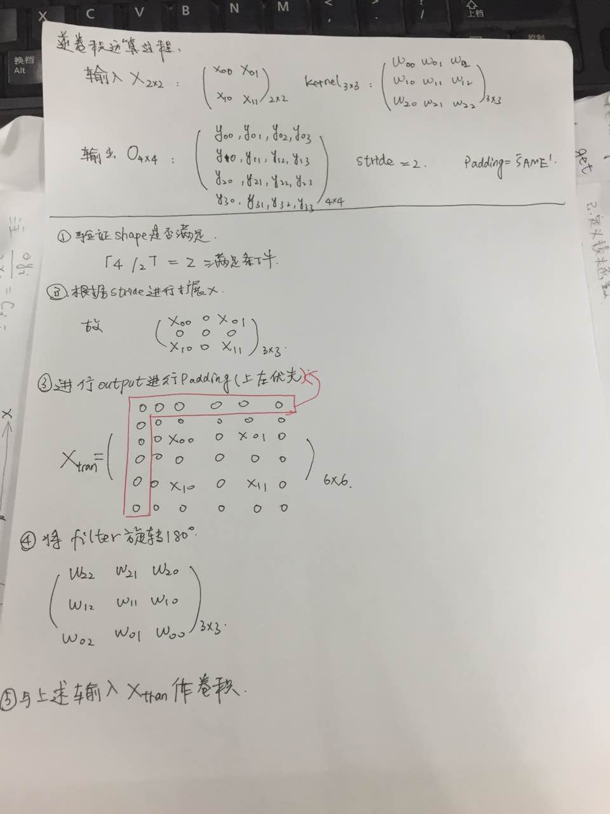

# convolution（卷积）


```python
tf.nn.conv2d(input,filter,strides,padding,use_cudnn_on_gpu,name=None)
"""
Args:
	input:[batch_size,height,width,in_channels]
	filter:[filter_height,filter_width,in_channels,out_channels]
	strides:[1,stride,stride,1]
	padding:'SAME' or 'VALID'
"""
```	

**filter不翻转，而是直接与对应位置相乘**

Suppose:
input_height:W,Filter_height:D,stride:S

1.如果padding='VALID'  
$$new\_height = new\_width = \lceil{(W-F+1)/S}\rceil$$
2.如果padding='SAME'  
$$new\_height = \lceil{W/S}\rceil$$

pad满足下面条件：
$$pad\_needed\_height = (new\_height-1)*S+F-W \\
pad\_top = pad\_needed\_height/2 \\
pad\_down = pad\_needed\_height - pad\_top$$

# Deconvolution(逆卷积)

会将filter转置180，然后与对应位置相乘。
```python
tf.nn.conv2d_transpose(value,filter,output_shape,strides,padding='SAME',data_formate,name)
"""
Args:
	value:[batch_size,height,width,in_channels]
	filter:[filter_height,filter_width,output_channels,in_channels]
	output_shape:1-D tensor
	strides:[1,stride,stride,1]
"""
```

## 逆卷积运算过程
0.判断shape是否符合。

根据卷积中input_shape和output_shape之间的关系，将output_shape带入判断是否shape之间是否符合运算要求。
例如：当padding='SAME',stride=1,input_shape=2的时候，则如果output_shape=4明显是不满足。但是如果stride=2的时候（output_shape/stride = input_shape ）,明显是满足条件的。

1.根据stride拓展、
如果stride为1，则保持原样
如果stride为2，则将输入x进行扩展

2.根据output_shape进行padding。
根据output的shape判断输入是否需要padding（上左方向padding优先）

3.将filter旋转180度

4.卷积

## 代码验证
该代码运行的结果，就验证了上述的反卷积规则的正确性
```python
import tensorflow as tf
x1 = tf.constant(1.0, shape=[1,2,2,1]) 
kernel = tf.Variable(tf.random_uniform([3,3,1,1]))
output_shape = [1,4,4,1]
y3 = tf.nn.conv2d_transpose(x1,kernel,output_shape=output_shape, strides=[1,2,2,1],padding="SAME") 
sess = tf.Session()
init = tf.global_variables_initializer()
sess.run(init)
print kernel.eval(session=sess)
print y3.eval(session=sess)
```

过程：
 


**Prove：逆卷积就是transpose convolution**
在理论上，逆卷积的这种计算方式，也就是transpose convolution的计算方式


知乎上的这个问题的答案，还是有不少比较好的回答。[链接](https://www.zhihu.com/question/43609045?sort=created)


